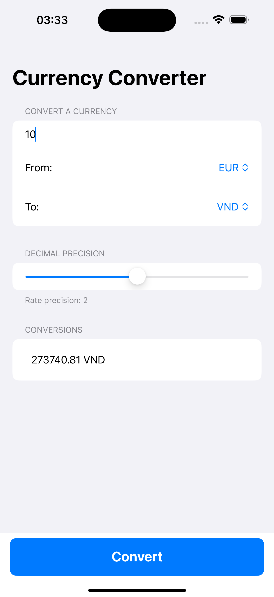
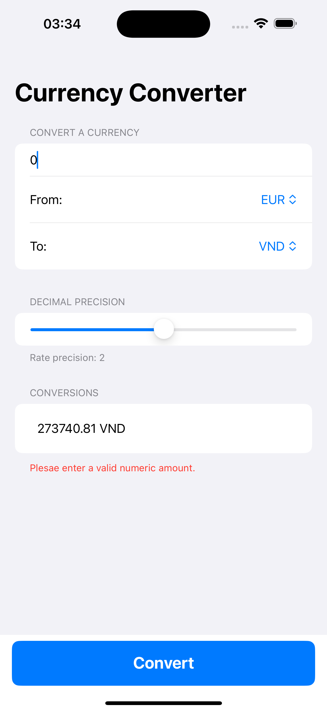

# Currency Converter

## App Structure
The Currency Converter app follows the MVVM (Model-View-ViewModel) architecture. The main components are:

- **Models**: Contains the data structures for the app.
  - `ExchangeRate`: Represents a currency exchange rate.
  - `SymbolsResponse`: Represents the response for currency symbols.
  - `ExchangeRateResponse`: Represents the response for exchange rates.

- **ViewModels**: Contains the logic and data binding for the views.
  - `CurrencyConverterViewModel`: Manages the state and logic for currency conversion.

- **Views**: Contains the UI components.
  - `ContentView`: The main view where users can input amounts, select currencies, and see the conversion results.

- **App Entry Point**:
  - `CurrencyConverterApp`: The main entry point of the app.

## Steps to Build and Run the App
1. **Clone the Repository**:
   ```sh
   git clone <repository-url>
    ```

2. **Open the Project**:
    Open the `CurrencyConverter.xcodeproj` file in Xcode.

3. **Build the Project**:
    - Select your target device or simulator.
    - Press `Cmd + B` to build the project.

4. **Run the App**:
    - Press `Cmd + R` to run the app on your selected device or simulator.

## Additional Notes or Challenges Encountered
- **API Key**: The app uses the free version of the exchangeratesapi API, which has some limitations. The app is limited to 100 requests per month. So if the app is used frequently, it may hit the rate limit and stop working.

- **Currency Symbols**: The app fetches the currency symbols from the API to display the correct currency symbols in the UI. Also use another API to fetch the exchange rates. Note that we can not directly use the convert API to fetch the exchange rates as it requires a paid subscription.

- **Error Handling**: The app handles errors such as network errors, API errors, and invalid user input. It displays appropriate error messages to the user and provides feedback on what went wrong.
 
- **UI/UX**: The app has a clean and simple UI that allows users to easily input amounts, select currencies, and see the conversion results. The UI is responsive and adapts to different screen sizes and orientations.

## Video Demonstration
- A video demonstration of the app is available [here](https://drive.google.com/file/d/1qFIngqnsq_9fGTqbtuxaIqr68C79XyZf/view?usp=sharing).

- Below are some screenshots of the app:




